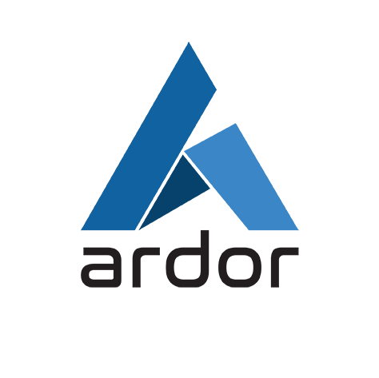

<p align="center">
  
  <br>
  <a href="https://travis-ci.org/ArdorNxtCommunity/ardor-api"></a>
</p>

<p align="center">Welcome the Ardor platform API documentation</p>

Introduction
------------

This repository holds the API documentation of [Ardor Blockchain Platform](https://www.ardorplatform.org/) and will be hosted on the Developers section.

Ardor is the first 3rd Generation blockchain platfrom which brings a smart innovative way to tackle many of the current blockchains problems seen today based on a combination of Parent-Childchain architecture, Lightweight Smart Contracts, Subnets, Prunable Blockchain and many other features in development roadmap.

Ardor vision is to bring an easy access to blockchain technology for everyone. This API documentation is specially targeted for developers, but non technical individuals can use explore the full potential potential of Ardor platform using its simple to use User Interface or Wallet that can be found [here](https://www.ardorplatform.org/).

How to get Started?
------------------------------

### Prerequisites

You're going to need:

 - **Linux or OS X** — Windows may work, but is unsupported.
 - **Ruby, version 2.3.1 or newer (but we recommend to stick with 2.3.* because of dependencies requesting versions less than 2.4.0)**
 - **Bundler** — If Ruby is already installed, but the `bundle` command doesn't work, just run `gem install bundler` in a terminal.


### Getting Set Up
1. Clone this repository from GitHub `git clone https://github.com/ArdorNxtCommunity/ardor-api.git`
2. `cd slate`
4. Initialize and start Slate. You can either do this locally, or with Vagrant:

```shell
bundle install
bundle exec middleman server
```

You can now see the docs at http://localhost:4567. Whoa! That was fast!

Now that Slate is all set up on your machine, you'll probably want to learn more about [editing Slate markdown](https://github.com/lord/slate/wiki/Markdown-Syntax), or [how to publish your docs](https://github.com/lord/slate/wiki/Deploying-Slate).

If you'd prefer to use Docker, instructions are available [in the wiki](https://github.com/lord/slate/wiki/Docker).

### Note on JavaScript Runtime

For those who don't have JavaScript runtime or are experiencing JavaScript runtime issues with ExecJS, it is recommended to add the [rubyracer gem](https://github.com/cowboyd/therubyracer) to your gemfile and run `bundle` again.

How to contribute ?
---------------------------------

If you want to contribute in writing and maintaining this documentation please proceed as follow:

- Clone this repo.
- Follow the Getting Started steps to set up your environment and build the documentation
- Open the code in your favorite IDE (Visual Studio Code can be fine)
- Start a contribution
- When you finish a contribution, please submit a Pull Request with a clear message defining the work done
- Your contribution will be reviewed and merged as soon as possible. But, please be prepared to receive comments and adjust your contribution

If you want to be a permanent contribution to this documentation, please contact us on [Slack](https://ardornxt.slack.com/) or [Discord](https://discord.gg/ZrBhZNp) channels

Questions? Need Help? Found a bug?
----------------------------------

If you have any question, need assistance or found an issue within the code or in the documentation, please visit the Ardor [Slack](https://ardornxt.slack.com/) or [Discord](https://discord.gg/ZrBhZNp) channels


Special Thanks
--------------------
This documentation is based on Open Source projects below. We want to thank them for their efforts and give them credit for all their contributions.
- [Slate](https://github.com/lord/slate)
- [Middleman](https://github.com/middleman/middleman)
- [jquery.tocify.js](https://github.com/gfranko/jquery.tocify.js)
- [middleman-syntax](https://github.com/middleman/middleman-syntax)
- [middleman-gh-pages](https://github.com/edgecase/middleman-gh-pages)
- [Font Awesome](http://fortawesome.github.io/Font-Awesome/)
